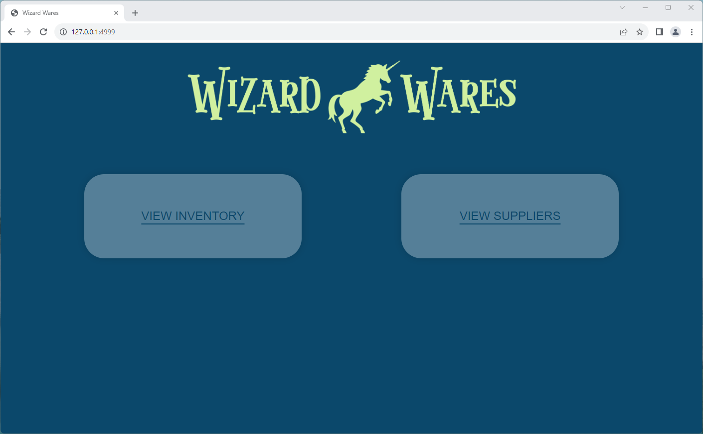
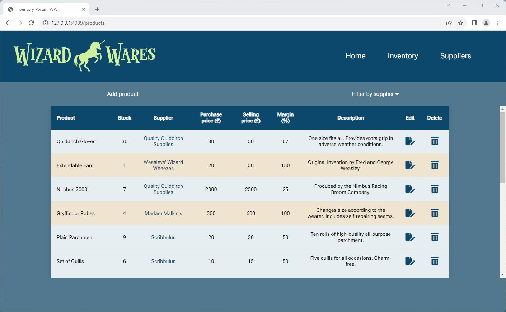
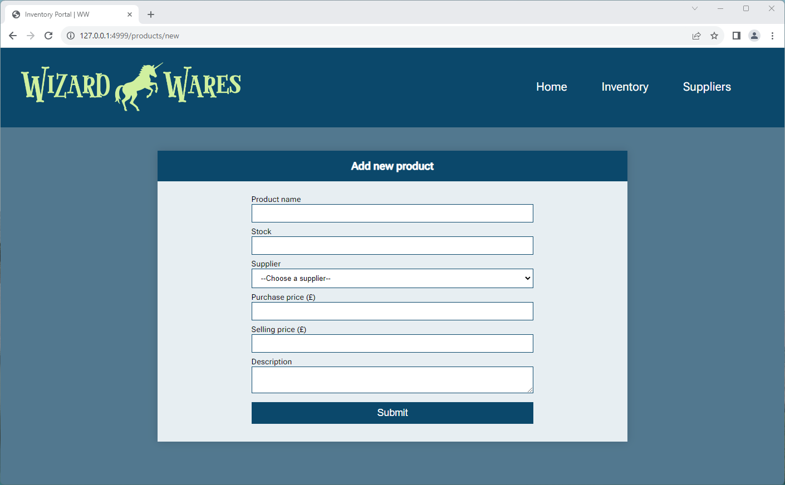

# Wizard Wares
An app for managing a shop's inventory, created with Python3 / Flask and PostgreSQL.

## Table of contents
* [Brief](#brief)
* [Images](#images)
* [Technologies](#technologies)
* [Setup](#setup)

## Brief
Build an app which allows a shopkeeper to track their shop's inventory. This is not an app which the customer will see, it is an admin/management app for the shop workers.
* The inventory should track individual products, including a name, description, stock quantity, buying cost, and selling price.
* The inventory should track manufacturers, including a name and any other appropriate details.
* Show an inventory page, listing all the details for all the products in stock in a single view.
* As well as showing stock quantity as a number, the app should visually highlight "low stock" and "out of stock" items to the user.
* Calculate the markup on items in the store, and display it in the inventory
* Filter the inventory list by manufacturer. For example, provide an option to view all books in stock by a certain author.

## Images






## Technologies
Project is created with:
* Python3
* Flask
* PostgreSQL

## Setup
1. Ensure you have the following installed:
* PostgreSQL (14.8)
* Psycopg2 (2.9.6)
* Python3 (3.11.3)
* Python-dotenv (1.0.0)
* Flask (2.3.2)

2. Create a `shop_inventory` database, e.g. via terminal:
```
$ createdb shop_inventory
```

3. Create database tables while in project directory:
```
$ cd ../python_app_shop_inventory
$ psql -d shop_inventory -f .\db\shop_inventory.sql
```

4. (Optional) Populate the database:
```
$ python3 console.py
```

5. Run the app:
```
$ flask run
```

6. App is now running on localhost:4999